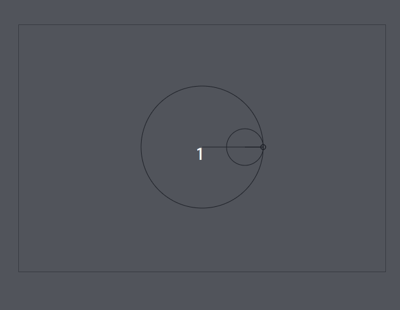
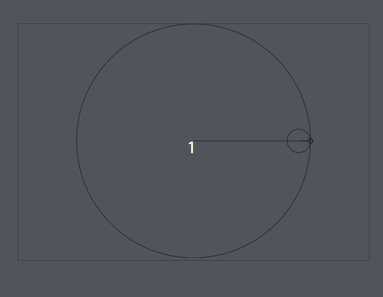

# Spirograph
An spirograph created with Javascript:



It's draw using [easelJS](https://www.createjs.com/easeljs), employing a bunch of trigonometry to do the calculations. If you want to play with different sizes or radius, the part where you can configure it is inside the `main.js` file:

```javascript
var $canvas = $("#canvas"),
    stage = new createjs.Stage($canvas.get(0)),
    originX = $canvas.width() / 2,
    originY = $canvas.height() / 2,
    majorRadius = 100,
    minorRadius = 30,
    minorPositionRadius = majorRadius - minorRadius,
    majorCircle,
    minorCircle,
    minorOriginX,
    lastDelta = 0,
    plotter = new GraphicsPlotter(stage);
```



You can execute it using some kind of live server and opening the `index.html` file. Just that.

Please, feel free to use it or adapt it for your own purposes.